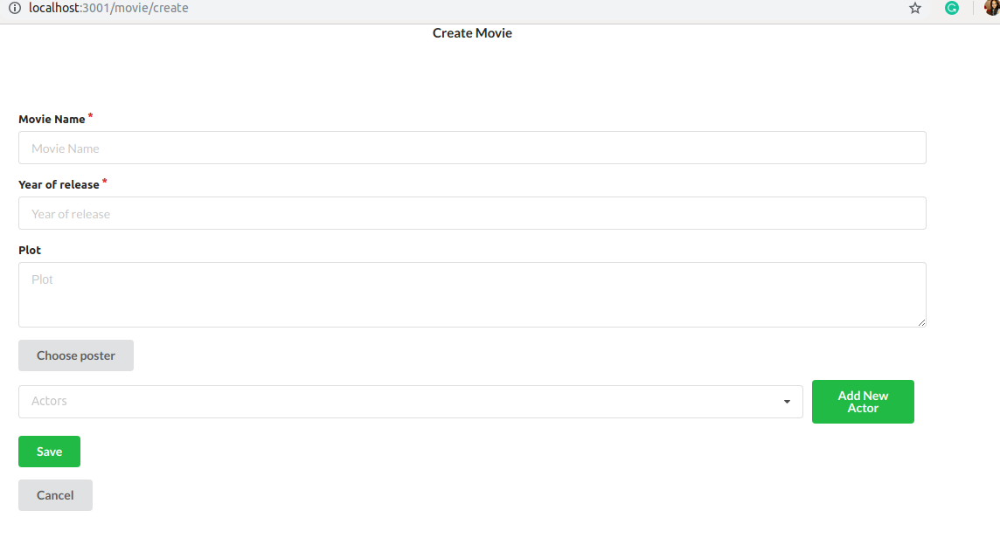

# imdb-react-node

Clone project and go to project using terminal.

# To start backend 
1. cd api
2. npm install
3. npm start

Note: Run backend on port 3000

# To start frontend 

1. cd front-end
2. npm install
3. npm start

Note: Run frontend on port other than 3000

# To access database
Note: you must have mongo shell installed to run below commands

mongo ds341837.mlab.com:41837/learning -u test -p test123

# DB Scripts

- show dbs
- use learning

To get all movies
- db.movies.find()

To get all actors
- db.actors.find()

# Validation
Used Mongoose orm for creating schema, Fields validation and running mongo database queries.
